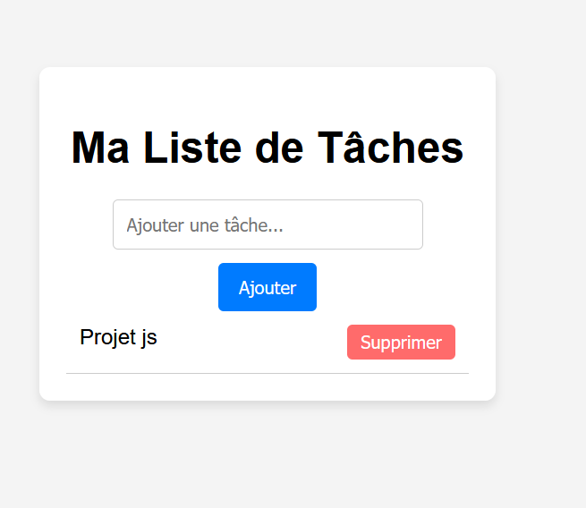

# 📝 To-Do List : Organisez vos tâches efficacement !

Bienvenue dans l'application **SimpleToDoApp**, un projet simple et efficace pour gérer vos tâches quotidiennes. Ce projet utilise **HTML**, **CSS** et **JavaScript** pour pratiquer la manipulation du DOM.

---

## 🎯 Fonctionnalités principales
- **Ajouter une tâche** : Inscrivez une tâche dans la liste.
- **Supprimer une tâche** : Supprimez une tâche terminée ou inutile.

---

## 📋 Structure du projet
Voici les fichiers inclus dans ce projet :

### `index.html`
Structure de la page web contenant les éléments suivants :
- Un champ d'entrée pour ajouter de nouvelles tâches.
- Une liste pour afficher les tâches.
- Boutons pour interagir avec les tâches.

---

### `style.css`
Styles pour :
- Une interface simple et moderne.
- Un design responsive pour s'adapter aux différents écrans.

---

### `script.js`
Fonctions JavaScript pour :
- Ajouter une nouvelle tâche.
- Gérer les événements  et supprimer des tâches.

---

## 🖼️ Aperçu


---

## 🚀 Lancer le projet
Pour tester l'application sur votre ordinateur :
1. Clonez ce dépôt :
   ```bash
   git clone https://github.com/mabrouka-triki/SimpleToDoApp.git
   
